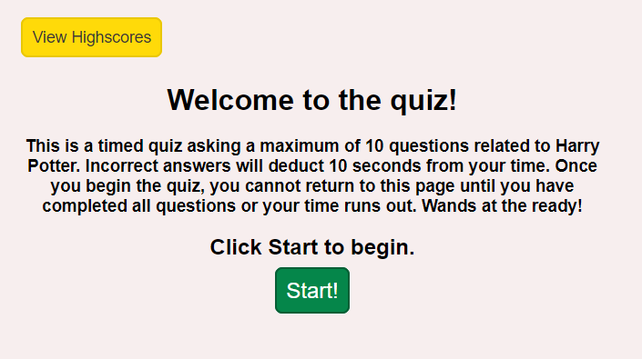
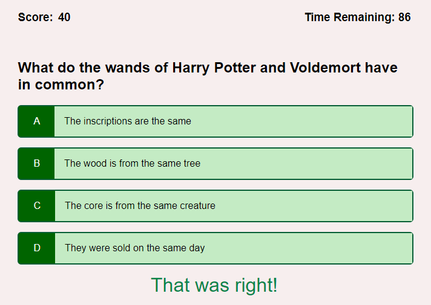
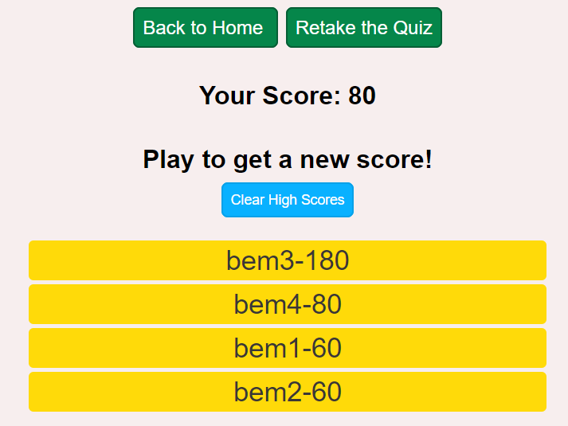
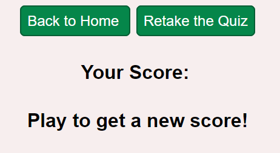
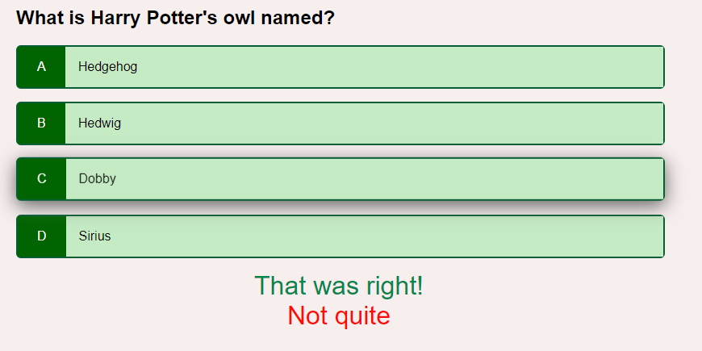
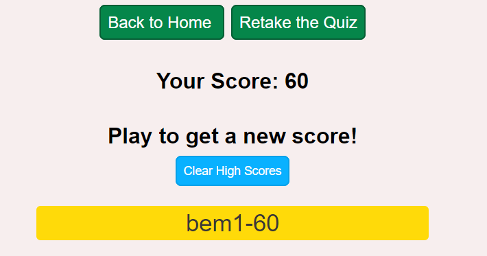
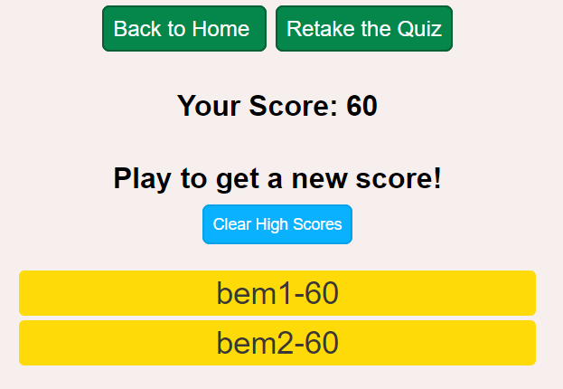
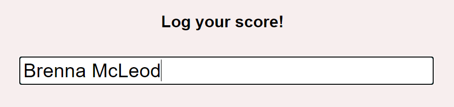

# Harry Potter Quiz
https://bmcleod12.github.io/queen-of-the-quiz/

## Description
This Harry Potter Quiz tests your knowledge of the wizarding world. There are 10 possible questions asked within 100 seconds; each worth 20 points. A wrong answer deducts 10 seconds from your time. If you complete all questions or the timer hits 0, you are redirected to a score page that asks you to provide your initials. You then have the option to clear those high scores, return to home, or retake the quiz.

## Installation
To create this application, I used unique HTML pages for each main feature (a welcome page, quiz page, and high score page), as well as unique javascript files for the quiz and high score pages, and one css style page to rule them all.

## Usage
Follow this link: https://bmcleod12.github.io/queen-of-the-quiz/ and you will land on the welcome page explaining the game:

The Start button here kicks off the quiz. You will recieve feedback after answering a question, whether correct or incorrect.

After all questions are answered or the time runs out, you will be directed to the high scores page where you have the opportunity to enter your initials.

After entering your initials, a button allowing you to clear those high scores appears. You can navigate back to home or to restart the quiz from here, as well.

## Tests and Known Issues
You can test this application by opening it in different browsers and changing the viewport size.

There is a known issue around the feedback messages. Each feedback message is set to display on screen for a second and a half, so if you click through the answers quickly, you may recieve more than one feedback message at a time.

There is a known issue where the input form returns after the user has obtained a score. In this example, I have completed the quiz with a score of 60 and recorded my initials.

I then clicked the Back to Home button, then View High Scores to return to this page. This page retained my score of 60, which is no problem, but allowed me to enter my initials again with this score. Ideally, after the user has entered initials for one score, the input form would be disabled until the user obtains a new score.

This next known issue is around the input form. It is simply unrestricted for now and allows users to enter full names instead of a limited number of characters.

## Future Enhancements
Aside from resolving the issues above, future enhancements include adding more visually appealing styling to the larger divs that wrap around the page content, adding graphics to immerse the user into the wizarding world, and adding a progress bar to display remaining questions as the user goes through the quiz.

## License

MIT License

Copyright (c) 2021 KU Boot Camp

Permission is hereby granted, free of charge, to any person obtaining a copy
of this software and associated documentation files (the "Software"), to deal
in the Software without restriction, including without limitation the rights
to use, copy, modify, merge, publish, distribute, sublicense, and/or sell
copies of the Software, and to permit persons to whom the Software is
furnished to do so, subject to the following conditions:

The above copyright notice and this permission notice shall be included in all
copies or substantial portions of the Software.

THE SOFTWARE IS PROVIDED "AS IS", WITHOUT WARRANTY OF ANY KIND, EXPRESS OR
IMPLIED, INCLUDING BUT NOT LIMITED TO THE WARRANTIES OF MERCHANTABILITY,
FITNESS FOR A PARTICULAR PURPOSE AND NONINFRINGEMENT. IN NO EVENT SHALL THE
AUTHORS OR COPYRIGHT HOLDERS BE LIABLE FOR ANY CLAIM, DAMAGES OR OTHER
LIABILITY, WHETHER IN AN ACTION OF CONTRACT, TORT OR OTHERWISE, ARISING FROM,
OUT OF OR IN CONNECTION WITH THE SOFTWARE OR THE USE OR OTHER DEALINGS IN THE
SOFTWARE.
